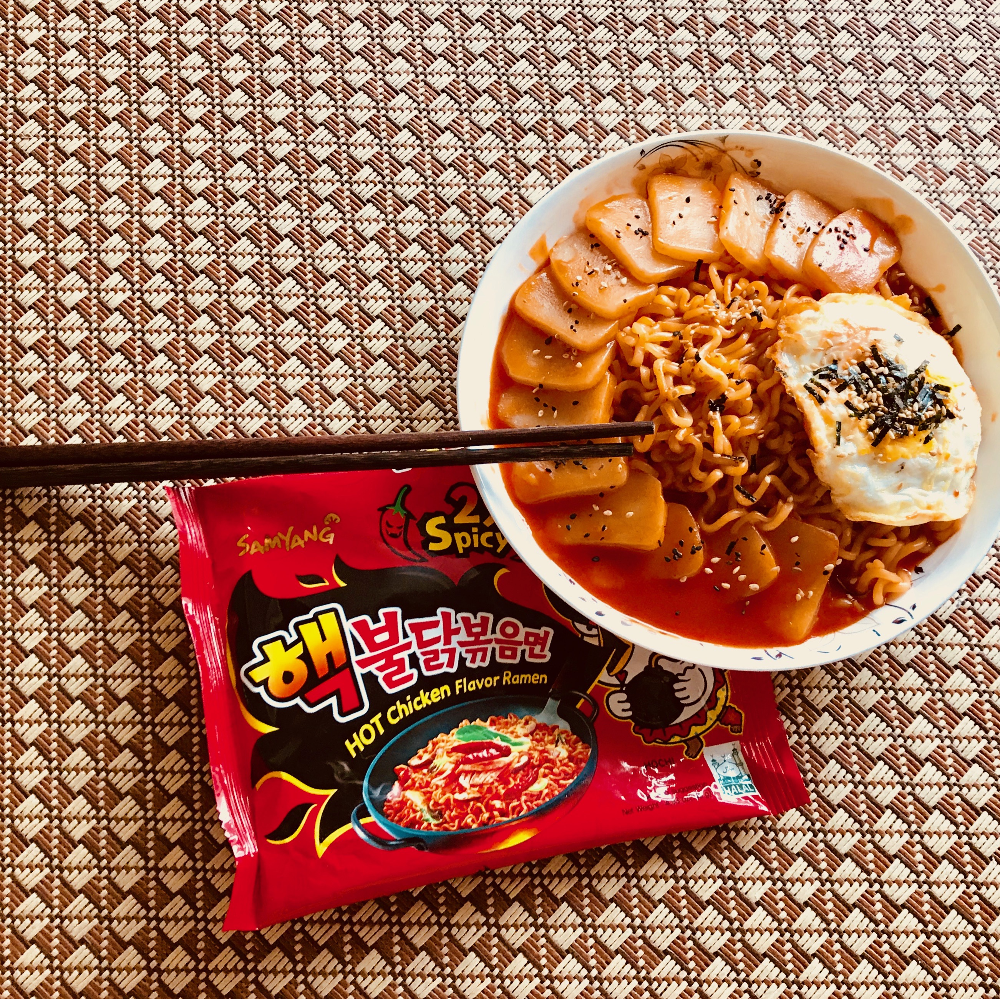

火鸡面改造计划 芝士年糕火鸡面（2-3人份）
-------------

### 准备
* 火鸡面一包w
* 奶酪丝50克w
* 火锅年糕150克w
* 卡夫芝士粉w
* 芝麻及海苔碎w
* 亨氏番茄酱50克w
* 一个锅子w
* 一位重庆/四川/湖南/江西人w

### 步骤
0. 开水煮面和年糕
0. 煮好后将水倒掉剩下100毫升+
0. 加入原来的酱料、番茄酱、奶酪丝
0. 翻炒30秒
0. 出锅后撒上芝麻海苔碎，当然也包括料包里的
0. 吃 露出笑容 然后再吃 吃到辣哭为止w
0. 吃不下去的话，就轮到准备表上的最后一项出场了

### 改造要点
火鸡面的缺点，是辣的没有内涵。
如果味觉层次丰富一些，
也就不会沦为开玩笑的工具啦。

### PS
如果觉得不够辣，可以将番茄酱换为泰式辣椒酱，
一定会让乃欲罢不能www
可是好吃也要量力而行哦。
